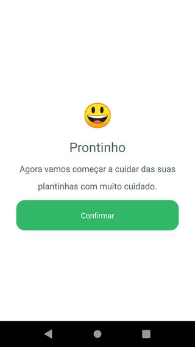
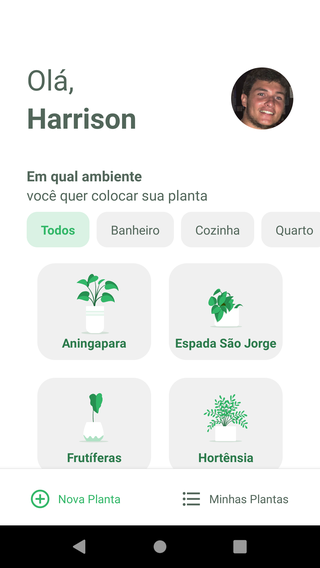
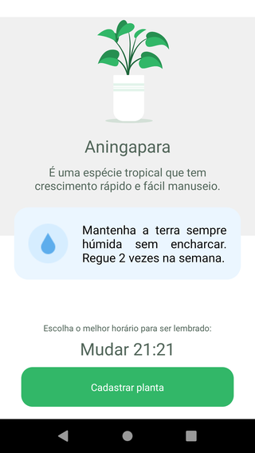
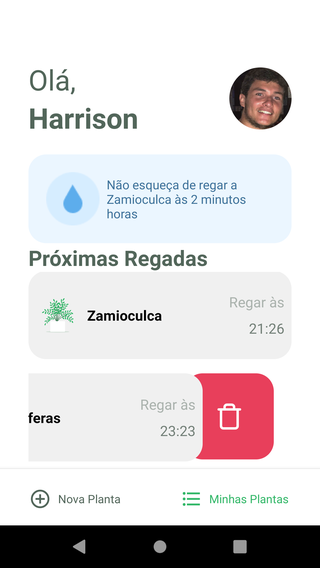
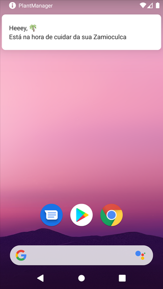

# Plant Manager

## About this Project

_"The objective of the project is to help people to remember to water your plants based on Next Level Week 5 by [Rockesea](https://rocketseat.com.br/)"._

## Why?

This project is part of my personal portfolio, so, I'll be happy if you could provide me any feedback about the project, code, structure or anything that you can report that could make me a better developer!

Email-me: harrisonhenrisn@gmail.com

Connect with me at [LinkedIn](https://linkedin.com/in/harrison-henri-dos-santos-nascimento).

Also, you can use this Project as you wish, be for study, be for make improvements or earn money with it!

It's free!

## Functionalities

- Welcome screen


- User's name screen


- Confirmation screen



- Plant select screen



- Plant save screen



- Plant list screen



- Local notifications




## Install

Clone the repo using

```
$ git clone https://github.com/HarrisonHenri/nlw5-plant-manager
```

```
$ cd nlw5-plant-manager
```

Install all the required dependencies

```
$ yarn
```

Install json-server globally

```
$ yarn add global json-server
```

Run the local server

```
$ npx json-server ./src/services/server.json --host <your_ip> --port 3333 --delay 700
```

Then execute

```
$ yarn start
```

## Built With

- [React](https://github.com/facebook/react) - Build the web app using JavaScript and React
- [React-navigation](https://github.com/react-navigation/react-navigation) - Routing and navigation for your React Native apps
- [React-native](https://github.com/expo/react-native) - Build the native app using JavaScript and React
- [Async Storage](https://github.com/react-native-async-storage/async-storage) - Key-value storage system
- [DatetimePicker](https://github.com/react-native-datetimepicker/datetimepicker) - React Native date & time picker component 
- [Axios](https://github.com/axios/axios) - HTTP Client
- [React-native push notification](https://github.com/zo0r/react-native-push-notification) - React Native Local and Remote Notifications for iOS and Android
- [React-native splash screen](https://github.com/crazycodeboy/react-native-splash-screen) - A splash screen API for react-native which can programatically hide and show the splash screen. Works on iOS and Android
- [React-native vector icons](https://github.com/oblador/react-native-vector-icons) 

## Contributing

You can send how many PR's do you want, I'll be glad to analyse and accept them! And if you have any question about the project...

Email-me: harrisonhenrisn@gmail.com

Connect with me at [LinkedIn](https://linkedin.com/in/harrison-henri-dos-santos-nascimento-a6ba33112).

Thank you!